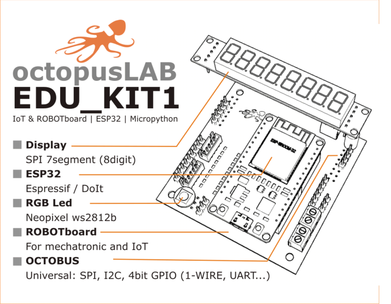
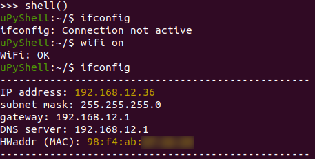
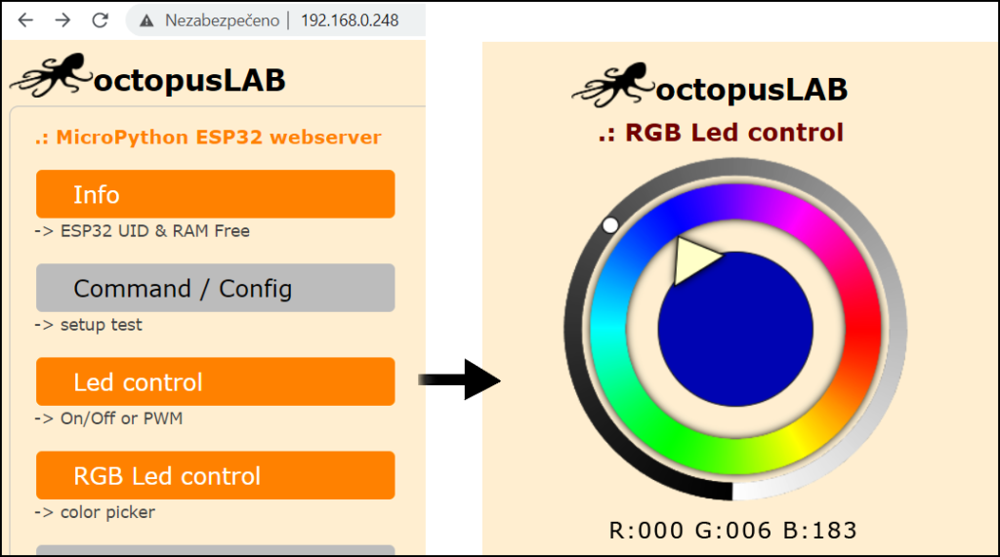

# OctopusLAB Web control

This repo contains ESP32 Micropython application based on **OctopusLAB Framework** -> [octopusengine/octopuslab](https://github.com/octopusengine/octopuslab).

This runs small web server with app, that allows you to control various peripherals connected to your [OctopusLAB EDU_KIT1](https://www.octopuslab.cz/edu-kit1/).

Feel free to modify the code if you have different pinout for connected modules or you need different control options!



## How to use

After connecting your ESP device to local wifi, we need to know what is on local IP of the device, you can find your IP in shell using `ifconfig` command, it's `192.168.12.36` in our example bellow.




If you have installed OctopusLAB Framework and this app correctly, you can now visit small web application to control your device. Open web browser and put device IP in the address bar, it's 192.168.0.248 in the example bellow.



Above picture on the right shows UI for controlling WS LED color.

## How to install

Upload from this repo to your ESP32 with OctopusLAB Framework (please install according to latest [docs](https://docs.octopuslab.cz/install/).):

- file `main.py`
- whole directory `www/`.

For upload use `ampy` command line tool ([docs](https://docs.octopuslab.cz/ampy/)) or FTP that's included in latest OctopusLAB Framework.

### Upload files using FTP

To upload files using FTP, follow these steps:

1) connect to your device using USB cable and open serial console ([docs for Win](https://docs.octopuslab.cz/install_win/#terminal-putty) [docs for Linux](https://docs.octopuslab.cz/install_linux/#terminal) [docs for Mac](https://docs.octopuslab.cz/install_mac/)).

2) start FTP server
```
>>> setup()
...
================================
          S E T U P
================================
 ...
 [ftp]  - start FTP
 [q]    - quit setup
================================
select: ftp
FTP Server started on  192.168.12.36
```

3) conect to FTP using your favorite FTP client (our is FileZilla https://filezilla-project.org/) and copy files (`main.py` to the root path and add `www/control/` to the `www/` on the device.
   
   Please note that you need to limit simultaneous connections to 1, our FTP server is single threaded.

4) reboot device, check new IP

5) Open IP in web browser and enjoy!

Hint: If you have already installed this Web control, you can enable FTP on your device if you press `BOOT` button when powering the device on. After you are done with your FTP upload, reboot device and Web control will start (without FTP) and you can test your new code.
 